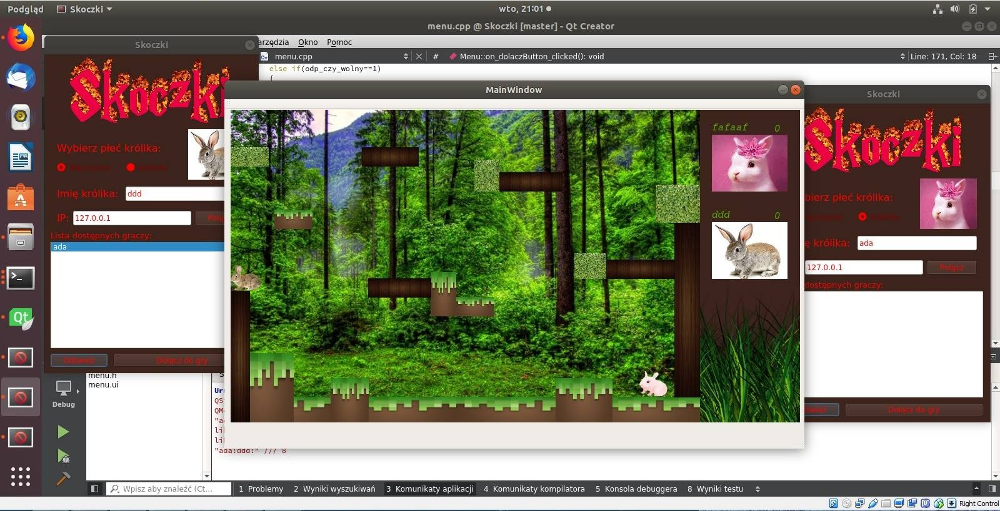

#Jump-Bump
Network game as a student project, where you need to jump on opponent rabbit to score. First one who'll reach 5 points will be a winner. This game in implemented on Linux system and it is able to play on two separete computers, connecting by computer IP. You can choose name and sex of your rabbit.

## Autorzy
	* Monika
	* Adam
	
